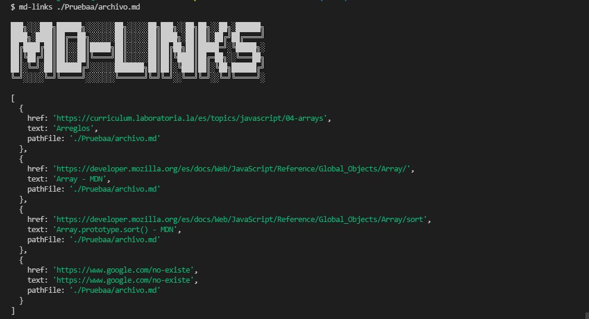
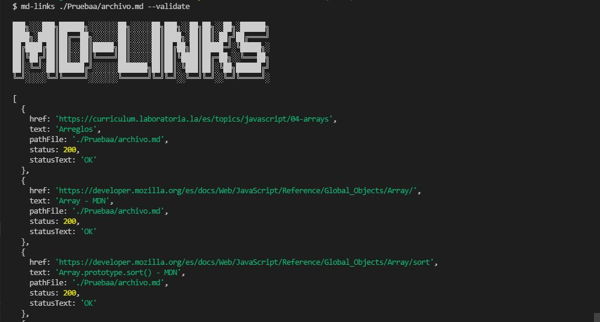
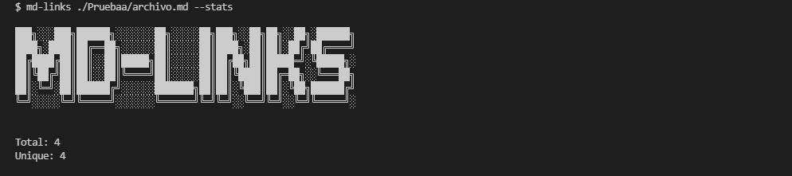
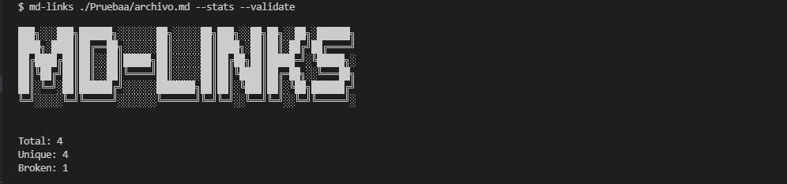
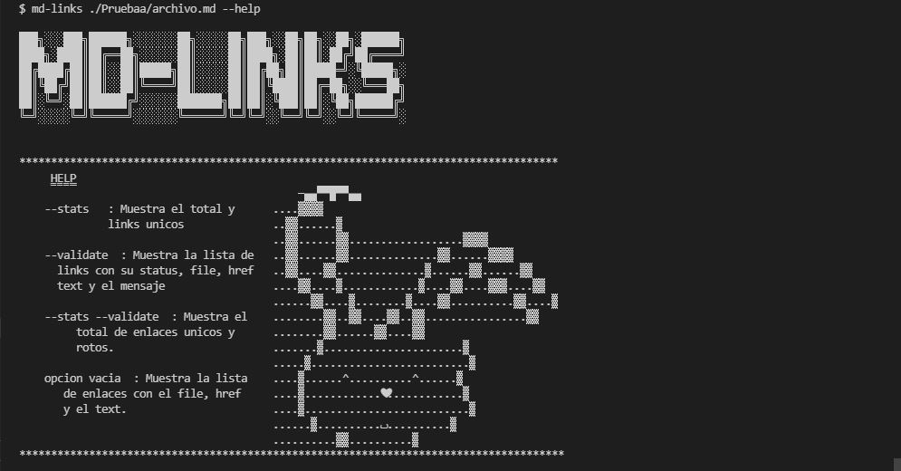

# MD-LINKS

Md-links es una libreria que lee y analiza los links que estan dentro de los archivos .md para asi reportar algunas estadisticas.

## Pruebas Unitarias

Para las pruebas unitarias utilizamos Jest.

## Instalación:

Para instalar esta librería debes ejecutar la siguiente linea de comando: `$ npm i md-links-rocio-sulca`. 
También puedes importarlo con require para usarlo programáticamente : `const mdLinks = require('md-links-rocio-sulca')`;

## Diagrama de flujo:

El [diagrama de flujo](https://lucid.app/lucidchart/invitations/accept/inv_86a6c318-dd1e-47da-8a58-0dd6c185d8d4?viewport_loc=249%2C1082%2C2144%2C941%2C51.7mHuhvyRz) para la implementación de la solución de md-Links.

## Guia de uso:

#### Options:

`path`
Esta línea de comando te permite ver todos los links sin la validación.

`path, --validate`
Esta línea de comando te permite ver los datos estadísticos de los links.

`path, --stats`
Esta línea de comando te permite saber cuantos links hay en total en el archivo y cuantos son unicos.

`path, --validate, --stats`
Esta línea de comando te permite saber cuantos links hay en total en el archivo, cuantos son unicos y cuantos links rotos hay.

`path, --help`
Esta linea de comando es si se desea ayuda  

